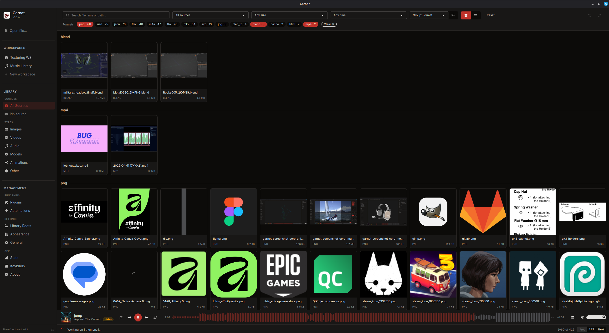
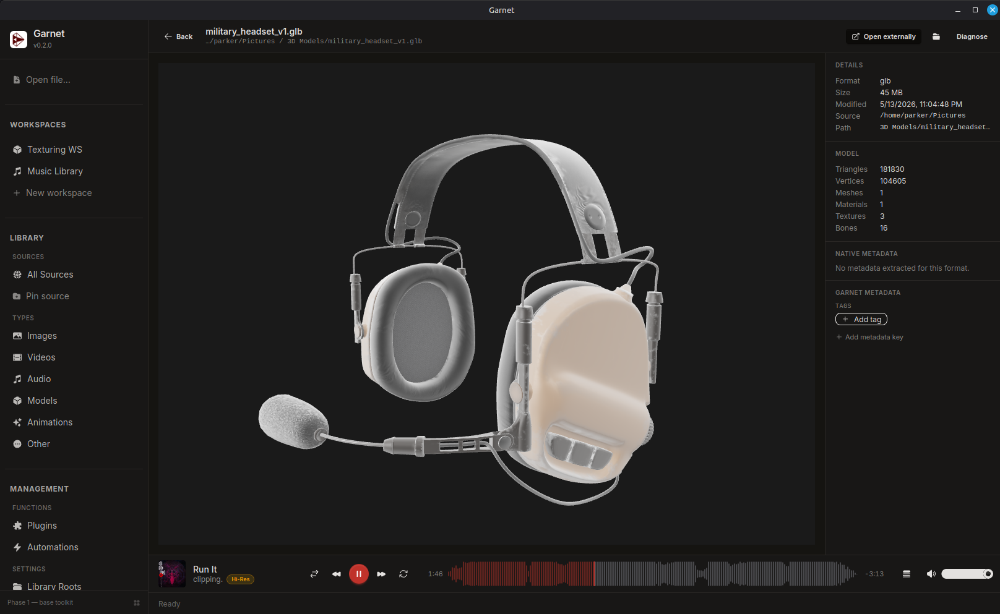
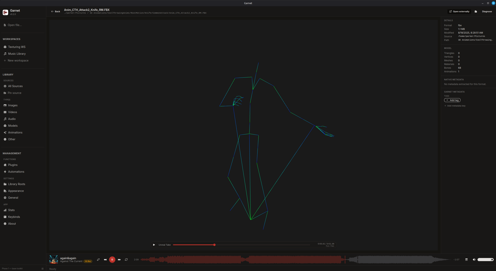
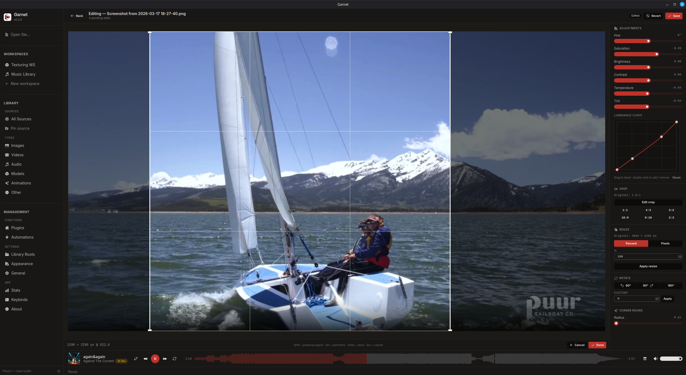
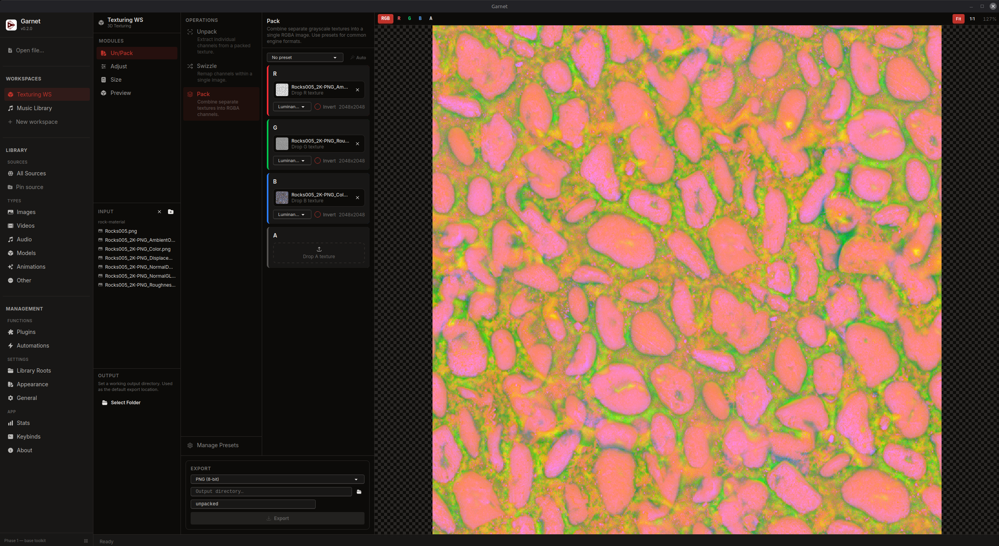
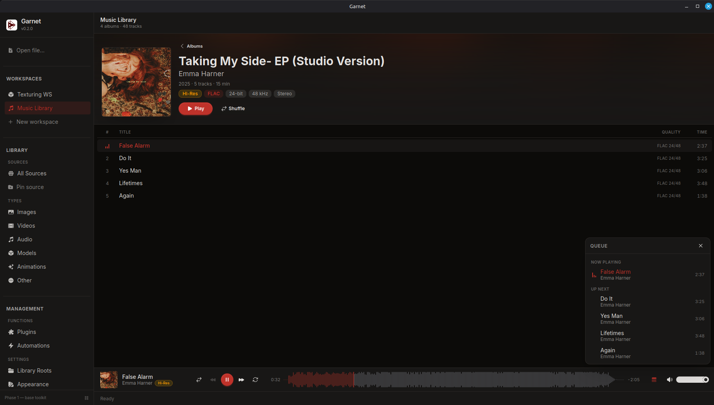

# Garnet

A free, open-source digital asset manager for a wide variety of asset types including image, video, audio, 3D models and animations, and more. The base install is a working DAM for any media type you drop into it: cross-format organization, search, preview, metadata, and built-in editing. Garnet is **offline and local**, operating as a surface over your local files. No proprietary library format, no forced ingestion, no cloud, no accounts. It indexes and operates where files already live.

I built Garnet as a media-first companion to one of my favorite and most personally important apps, [Obsidian](https://obsidian.md). Obsidian is a fantastic tool with a wonderful local-first philosophy, and I use it to manage all of my active documents and non-media files. But, as one might expect, it wasn't the right shape/feature fit for managing and editing media files -- of which I have a lot through my personal and professional projects in game and software development, music and video production, and photography.

Rather than investing time, money, and complexity into a variety of esoteric media tools (or at least, more than I already had) for the simple work of managing, previewing, and performing basic edits on my files, I designed Garnet as the simple surface layer over all of that content.

> [!NOTE]
> Garnet is still in an early stage of development, with notable functionality limitations. What's there should work without issue, but you'll see a lot of gaps where core or plugin functions have yet to be built.

---

## Core Features

Garnet's base install is a basic multi-format DAM: it catalogs, previews, searches, lightly edits, and batch-processes a wide variety of media formats, operating as an index over wherever your files already live. Nothing is copied into a proprietary library; Garnet works in place.

### Catalog & Browsing



Register any number of folders as **library roots** and Garnet indexes them in place, tracking files across moves and renames by content hash and rescanning automatically as the folders change on disk.

- Paginated grid or list view; **group** by folder, format, source, or date, and sort by any column
- **Filter** by format, size, and modified-date range; full-text **search** on filename and path
- One-click **type views**: Images, Videos, Audio, Models, Animations, Other
- **Tag** assets and filter by tag; **pin** any root or subfolder to the sidebar; organize work into **Workspaces**
- **Open a loose file ad-hoc** (`Ctrl/Cmd+O`): point Garnet at any file *outside* your library and get its full preview and editor surfaces without adding it to the catalog

### Previews & Quick-Look



Inline, zero-config preview for every common media type, with cached thumbnails throughout the grid.

- **Images, video, and audio** play inline; a loopback media server keeps video and audio reliable on Linux
- **3D models** (glTF/GLB, OBJ, STL, PLY, FBX, USD) render in an interactive WebGL viewer with triangle, vertex, mesh, material, and bone counts
- **Skeletal animations** play back with a scrub timeline



- A details panel surfaces **native metadata** like image dimensions, EXIF (camera, lens, exposure), and audio tags: alongside your own tags
- Thumbnails for images, videos, 3D models, and `.blend` files (extracted from the embedded preview)

### Image Editor



A non-destructive editor that previews on the original at full resolution (GPU-accelerated) and only writes pixels when you save.

- **Adjustments**: hue, saturation, brightness, contrast, temperature, and tint
- **Luminance curve**: a draggable monotonic spline driving a live lookup table
- **Geometry**: crop (aspect-ratio presets + rule-of-thirds guides), resize, rotate, and corner-round
- Hold `\` to peek the original, full undo/redo, and a choice of **save-as-new** or **overwrite**

### Automations

Build reusable batch pipelines and run them across many files at once: base steps (**convert**, **resize**, and **rename** with token patterns) plus steps contributed by plugins. Runs in parallel with live progress in the footer, and pipelines save as named presets.

---

## Plugin Features

Plugins add per-format depth on top of the base. Each is first-party, compiles into the app, and is toggled on or off from the in-app plugin manager. Garnet ships with two today.

### 3D Texturing



The full toolset from [Packi](https://github.com/parkerhdavis/Packi), woven in as a workspace with tabbed tools.

- **Pack**: channel pack / unpack / swizzle with per-channel source selection and invert, live preview, and presets for common conventions (Unreal ORM, Unity mask maps, RMA, Godot ORM, and more)
- **Adjust**: normal-map operations like flip green (DirectX ↔ OpenGL), height-to-normal, blend (RNM), and normalize
- **Preview**: a 2D tiling preview and a 3D PBR material preview
- **Size**: texture info, VRAM budget across 16+ GPU compression formats, and the full mip chain
- Contributes Flip Green / Normalize steps to the base Automations pipeline

### Music Library



A catalog-backed workspace that organizes your indexed audio into an **album-artist → album → track** tree with album-cover browsing and a built-in player.

- Native Rust audio engine (Symphonia + Rodio) for reliable, high-quality local playback: including Hi-Res and FLAC
- Docked transport with a play queue and a **waveform** rendered from precomputed peaks
- Reads embedded tags and cover art; per-track quality badges (format, bit depth, sample rate)

---

## Stack

- **Runtime / Package Manager:** Bun
- **Desktop Framework:** Tauri 2 (Rust backend)
- **Frontend:** React 19 + TypeScript
- **Styling:** Tailwind CSS 4 + daisyUI 5
- **State Management:** Zustand 5
- **Library DB:** SQLite via `rusqlite`

Stack mirrors [Packi](https://github.com/parkerhdavis/Packi) for code reuse and a consistent offline/local ethos.

---

## Development

```bash
# Install Rust + Bun + system deps, then install JS dependencies
make setup

# Run in development mode (Tauri + frontend hot reload)
make dev

# Build installer for the current platform
make build

# Quality
make lint typecheck test
```

The library SQLite file lands at `$XDG_DATA_HOME/garnet/library.sqlite` (or the OS equivalent); logs go to `$XDG_CONFIG_HOME/garnet/logs/`.

---

## License

Covered under the GNU Affero General Public License v3.0 or later (AGPL-3.0-or-later): see [LICENSE.md](./LICENSE.md).

Beyond that, I only have one rule: **First, do no harm. Then, help where you can.**

---

## Financial Support

If you have some cash to spare and are inspired to share, that's very kind. Rather than sharing that kindness with me, I encourage you to share it with your charity of choice.

Mine is the [GiveWell top charities fund](https://www.givewell.org/top-charities-fund), which does excellent research to figure out which causes can save the most human lives for the money, and puts their funds there.

Their grant to the [Against Malaria Foundation](https://www.againstmalaria.com) was shown to deliver outcomes at a cost of just $1,700 per life saved.


